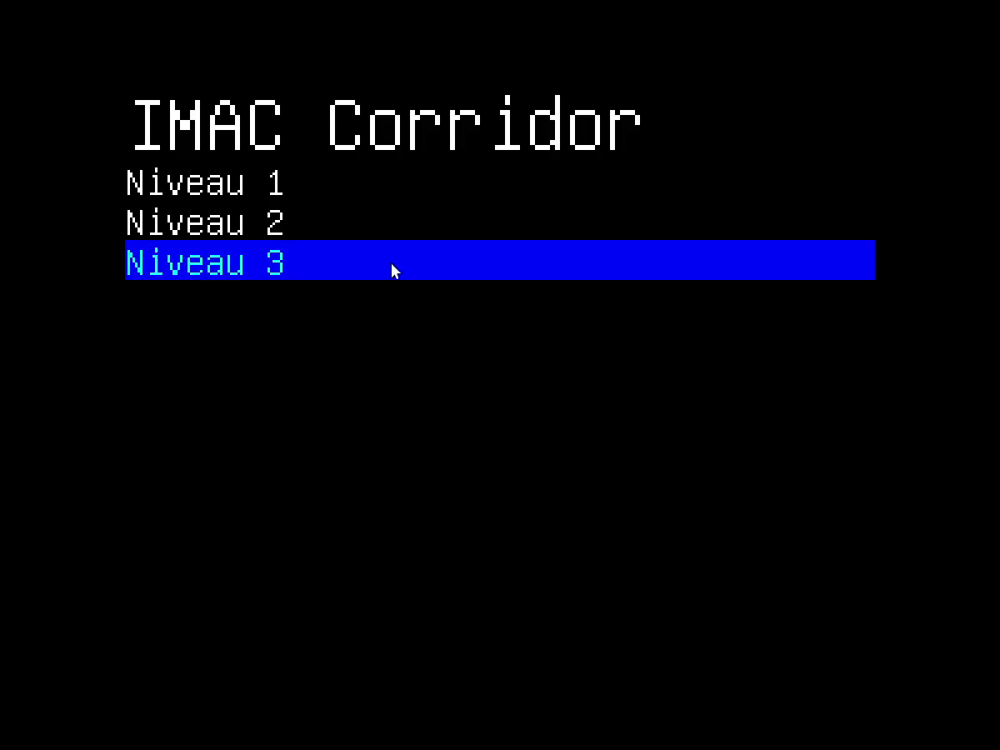
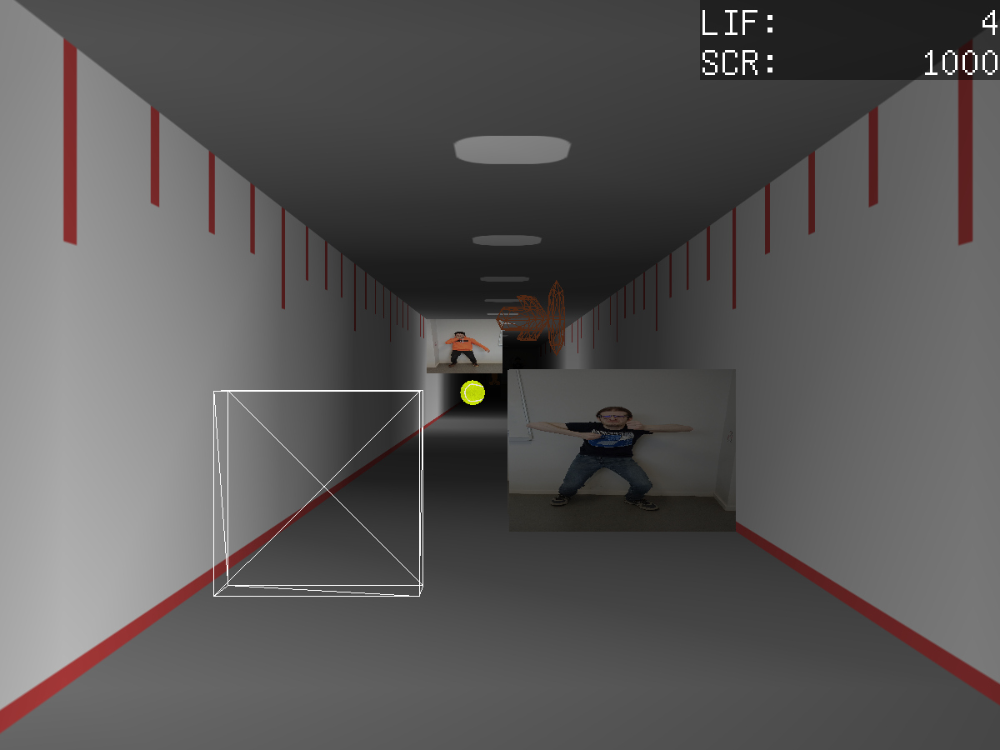
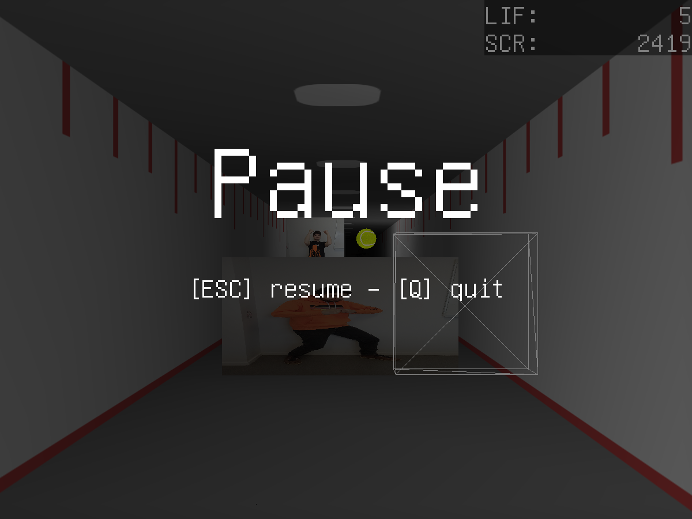
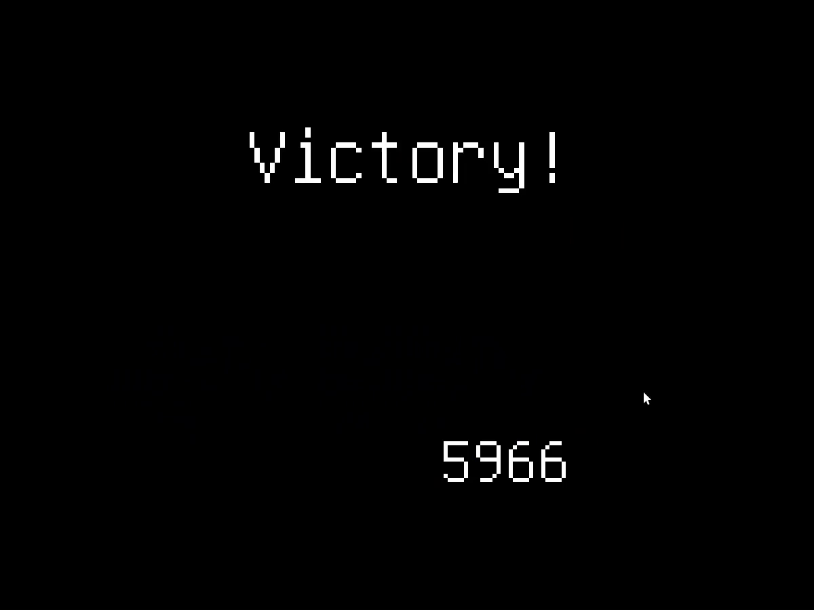

# The IMAC Light Corridor

&copy; TotoShampoin, Oradimi 2023

## Mode d’installation
Le jeu se compile sur Linux avec un makefile. Ouvrir le dossier du projet et effectuer la commande make permet de compiler le projet sous le dossier ./bin en tant qu’un fichier nommé imac-corridor.

## Fonctionnement

Le jeu démarre sur un écran de sélection de niveau. On peut utiliser le curseur de la souris pour pointer sur les niveaux dans la liste, et faire un clic gauche sur un des niveaux pour le démarrer. Le niveau commence alors directement, avec la balle collée à la raquette, la raquette pouvant être contrôlée avec la position de la souris, et le niveau et ses obstacles s’étendant devant le joueur. Faire un clic gauche permet d’envoyer la balle, qui part en ligne droite. La balle rebondit de manière symétrique par rapport aux normales des murs et sa direction d’entrée en collision. Cependant, elle rebondit contre la raquette comme s’il s’agissait d’un plan bombé. Une fois la balle envoyée, le joueur peut faire avancer la raquette avec la touche Z (W sur QWERTY) pour progresser, tout comme dans “The Light Corridor”. Trois bonus ont divers effets : le premier agrandit la raquette, le deuxième ralentit la balle, le troisième arrête la balle à chaque fois qu'elle touche la raquette. Clic gauche pour la relancer.

## Résultats obtenus

Nous avons donc un jeu compilant trois niveaux, où la balle a une texture de balle de golf, les murs font penser aux couloirs du bâtiment Copernic, et les obstacles sont des camarades de classe qui bloquent le chemin.

    
    

La raquette et la balle “émettent” de la lumière visible sur les murs, les obstacles et les différents bonus répartis dans le couloir. 

Un écran de pause, de défaite, de victoire, ainsi qu’une interface basique pour afficher les points de vie et le score ont été ajoutés.

## Méthode de travail

Pendant la majorité du déroulé, nous avons fait des petites réunions pour décider des objectifs à atteindre sur le programme pour chacun de nous. Vers la fin, Thomas s’est majoritairement concentré sur le code pendant que Logan fournissait certains assets, tels que les sound effects, les modèles 3D de bonus ou les niveaux, et s’est occupé d’une petite partie du code aussi.

## Détails techniques

L’ensemble du jeu a été développé avec une approche orientée objet, et dans l’intention de rendre chaque élément plus modulaire. Par exemple, les bonus fonctionnent grâce à une paire de fonctions, une au début et une à la fin de son intervalle de temps, toutes deux ayant une influence uniquement sur le joueur. Cela simplifie grandement l’ajout de nouveaux bonus, et cela a surtout permis d’implémenter la ligne d’arrivée du niveau via un bonus spécial (le bonus 0), qui active le flag de victoire dans le joueur.

La gestion événementielle de nos structures se fait par des flags, des indicateurs booléens, qui sont mis à false à la fin de chaque instance de la boucle de jeu. Ainsi, on peut, par exemple, activer l’effet sonore adéquat tout en le gardant dans une fonction Audio.

Les modèles 3D et les niveaux sont stockés en binaire dans des fichiers, via un format personnalisé, générés par des scripts Python. Cela nous permet de les créer et implémenter très facilement, avec Blender pour les modèles, et un éditeur de texte pour les niveaux.

La raquette émet de la lumière plutôt que la caméra, ce qui fait que le mur sera plus éclairé du côté où le curseur se trouve. Par ailleurs, la caméra se déplace très légèrement avec la raquette, ce qui permet de rendre le gameplay un peu plus dynamique.

Les obstacles et bonus s’estompent progressivement lorsqu’ils sont très près de la caméra. Pour que l’on puisse bien tout voir (par rapport au Z Buffer), ceux-ci sont triés par ordre du plus éloigné au plus proche.

### Difficultés techniques et solutions

Une grande question qui nous a légèrement posé problème était: Comment implémenter les différents éléments graphiques (modèles, textures, audio…). Nous aurions pu les mettre directement dans leurs structures concernées (donc l’objet 3d de la balle dans la classe Ball). Mais la gestion des allocations par OpenGL a fait que cela n’était pas possible. Nous aurions pu utiliser des pointeurs, mais à la place, nous avons mis ces éléments graphiques dans les fonctions d’affichages qui les utilisent, sous la forme de variables statiques pour ne pas qu’elles se rechargent à chaque itération.

## Difficultés en général

La répartition des tâches pour le projet était parfois difficile, ne serait-ce que parce qu’il fallait déjà savoir à l’avance ce qu’il fallait faire, ce qui pouvait être encore plus difficile.

Aussi, ayant pris une approche objet et modulaire, nous avons été un peu à l’aveugle au début du développement, jusqu’à ce que nous ayons de quoi afficher des objets 3D (pour tester les collisions, par exemple).

Et la charge de travail imposée par les autres projets et examens en parallèle a également ralenti le développement.

## Améliorations possibles

Ajouter des obstacles qui coulissent, des boss, un mode “histoire” où les niveaux s’enchaînent jusqu’à un final. La gestion des collisions pourrait également être améliorée. 

Une meilleure interface graphique serait la bienvenue aussi. Par exemple, le menu aurait pu être la porte d’entrée du couloir, où on contrôle déjà la balle, les boutons étant des bonus. La GUI in-game aurait pu être mieux intégrée, avec un indicateur de durée pour les bonus.

Plus de contenu pour le jeu aurait été intéressant : plus de bonus, de niveaux et de modes, comme par exemple un mode contre-la-montre.
